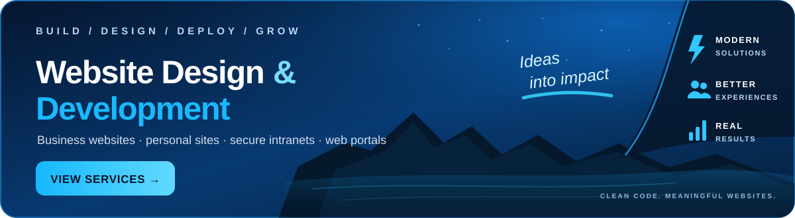

  <a href="https://marcadonislevy.github.io/website-design-services/" aria-label="View Marc Levy's website design and development services">
    <picture>
      <source media="(max-width: 600px)" srcset="./assets/services-banner-mobile.svg">
      
    </picture>
  </a>
    

  <picture>
    <source media="(prefers-color-scheme: dark) and (max-width: 767px)" srcset="./assets/profile-mobile-dark.svg">
    <source media="(prefers-color-scheme: light) and (max-width: 767px)" srcset="./assets/profile-mobile-light.svg">
    <source media="(prefers-color-scheme: dark) and (min-width: 768px) and (max-width: 1003px)" srcset="./assets/profile-compact-dark.svg">
    <source media="(prefers-color-scheme: light) and (min-width: 768px) and (max-width: 1003px)" srcset="./assets/profile-compact-light.svg">
    <source media="(prefers-color-scheme: dark) and (min-width: 1004px)" srcset="./assets/profile-desktop-dark.svg">
    <source media="(prefers-color-scheme: light) and (min-width: 1004px)" srcset="./assets/profile-desktop-light.svg">
    
  </picture>

