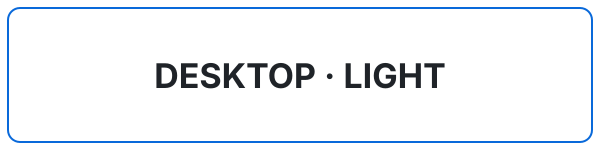

# Responsive picture feasibility probe

<picture>
  <source media="(prefers-color-scheme: dark) and (max-width: 767px)" srcset="./assets/profile-probe-mobile-dark.svg">
  <source media="(prefers-color-scheme: light) and (max-width: 767px)" srcset="./assets/profile-probe-mobile-light.svg">
  <source media="(prefers-color-scheme: dark) and (min-width: 768px) and (max-width: 1003px)" srcset="./assets/profile-probe-compact-dark.svg">
  <source media="(prefers-color-scheme: light) and (min-width: 768px) and (max-width: 1003px)" srcset="./assets/profile-probe-compact-light.svg">
  <source media="(prefers-color-scheme: dark) and (min-width: 1004px)" srcset="./assets/profile-probe-desktop-dark.svg">
  <source media="(prefers-color-scheme: light) and (min-width: 1004px)" srcset="./assets/profile-probe-desktop-light.svg">
  
</picture>

## Verified result — 31 August 2026

GitHub's Markdown API preserved all six `<source>` elements, their `media` conditions and `srcset` paths. Headless Chromium renders from the GitHub-sanitised HTML confirmed:

| Browser width | Light theme | Dark theme |
|---:|---|---|
| 375 px | MOBILE · LIGHT | MOBILE · DARK |
| 430 px | MOBILE · LIGHT | MOBILE · DARK |
| 768 px | COMPACT · LIGHT | COMPACT · DARK |
| 1,024 px | DESKTOP · LIGHT | DESKTOP · DARK |
| 1,440 px | DESKTOP · LIGHT | DESKTOP · DARK |

Verification workflow: `Verify responsive picture probe`, run `33343229421`.
